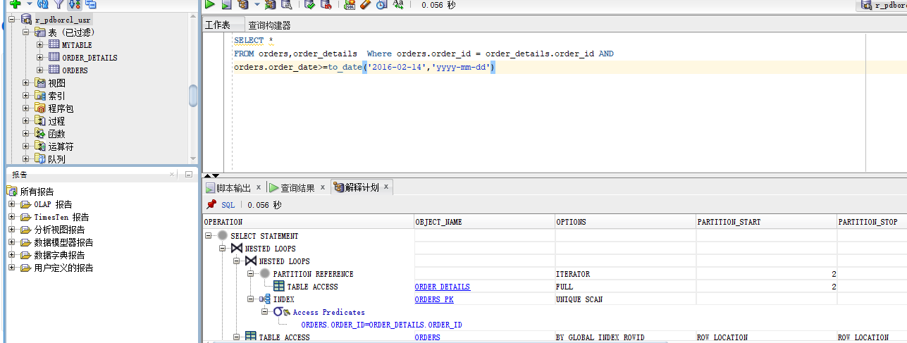

# 实验3：创建分区表

## 实验目的：

掌握分区表的创建方法，掌握各种分区方式的使用场景。

## 实验内容：
- 本实验使用3个表空间：USERS,USERS02,USERS03。在表空间中创建两张表：订单表(orders)与订单详表(order_details)。
- 使用**你自己的账号创建本实验的表**，表创建在上述3个分区，自定义分区策略。
- 你需要使用system用户给你自己的账号分配上述分区的使用权限。你需要使用system用户给你的用户分配可以查询执行计划的权限。
- 表创建成功后，插入数据，数据能并平均分布到各个分区。每个表的数据都应该大于1万行，对表进行联合查询。
- 写出插入数据的语句和查询数据的语句，并分析语句的执行计划。
- 进行分区与不分区的对比实验。

## 实验参考步骤
### 步骤1：
- 使用system给用户new_usr分配3个表空间：USERS,USERS02,USERS03。

- 创建订单表(orders)与订单详表(order_details)。
 orders表：
```SQL
 CREATE TABLE orders 
(
 order_id NUMBER(10, 0) NOT NULL 
 , customer_name VARCHAR2(40 BYTE) NOT NULL 
 , customer_tel VARCHAR2(40 BYTE) NOT NULL 
 , order_date DATE NOT NULL 
 , employee_id NUMBER(6, 0) NOT NULL 
 , discount NUMBER(8, 2) DEFAULT 0 
 , trade_receivable NUMBER(8, 2) DEFAULT 0 
) 
TABLESPACE USERS 
PCTFREE 10 INITRANS 1 
STORAGE (   BUFFER_POOL DEFAULT ) 
NOCOMPRESS NOPARALLEL 
PARTITION BY RANGE (order_date) 
(
 PARTITION PARTITION_BEFORE_2016 VALUES LESS THAN (
 TO_DATE(' 2016-01-01 00:00:00', 'SYYYY-MM-DD HH24:MI:SS', 
 'NLS_CALENDAR=GREGORIAN')) 
 NOLOGGING 
 TABLESPACE USERS 
 PCTFREE 10 
 INITRANS 1 
 STORAGE 
( 
 INITIAL 8388608 
 NEXT 1048576 
 MINEXTENTS 1 
 MAXEXTENTS UNLIMITED 
 BUFFER_POOL DEFAULT 
) 
NOCOMPRESS NO INMEMORY  
, PARTITION PARTITION_BEFORE_2017 VALUES LESS THAN (
TO_DATE(' 2017-01-01 00:00:00', 'SYYYY-MM-DD HH24:MI:SS', 
'NLS_CALENDAR=GREGORIAN')) 
NOLOGGING 
TABLESPACE USERS02 
 PCTFREE 10 
 INITRANS 1 
 STORAGE 
( 
 INITIAL 8388608 
 NEXT 1048576 
 MINEXTENTS 1 
 MAXEXTENTS UNLIMITED 
 BUFFER_POOL DEFAULT 
) 
NOCOMPRESS NO INMEMORY  
, PARTITION PARTITION_BEFORE_2018 VALUES LESS THAN (
TO_DATE(' 2018-01-01 00:00:00', 'SYYYY-MM-DD HH24:MI:SS', 
'NLS_CALENDAR=GREGORIAN')) 
NOLOGGING 
TABLESPACE USERS03 
);

```
order_details表:
```SQL
CREATE TABLE order_details
(
id NUMBER(10, 0) NOT NULL
, order_id NUMBER(10, 0) NOT NULL
, product_id VARCHAR2(40 BYTE) NOT NULL
, product_price NUMBER(8, 2) NOT NULL
, product_num NUMBER(8, 2) NOT NULL
, product_price NUMBER(8, 2) NOT NULL
ENABLE
)
, CONSTRAINT order_details_fk1 FOREIGN KEY  (order_id)
TABLESPACE USERS
REFERENCES orders(order_id)
PCTFREE 10 INITRANS 1
STORAGE (   BUFFER_POOL DEFAULT )
ENABLE
)
TABLESPACE USERS
PCTFREE 10 INITRANS 1
NOCOMPRESS NOPARALLEL
PARTITION BY REFERENCE (order_details_fk1)
(
STORAGE (   BUFFER_POOL DEFAULT )
PARTITION PARTITION_BEFORE_2016
NOCOMPRESS NOPARALLEL
TABLESPACE USERS
PARTITION BY REFERENCE (order_details_fk1)
(
PARTITION PARTITION_BEFORE_2016
(
NOLOGGING
TABLESPACE USERS
PCTFREE 10
MAXEXTENTS UNLIMITED
BUFFER_POOL DEFAULT
INITRANS 1
STORAGE
)
NOCOMPRESS NO INMEMORY,
(
INITIAL 8388608
NEXT 1048576
NOLOGGING
MINEXTENTS 1
TABLESPACE USERS02
MAXEXTENTS UNLIMITED
BUFFER_POOL DEFAULT
)
NOCOMPRESS NO INMEMORY,
PARTITION PARTITION_BEFORE_2017
(
NOLOGGING
TABLESPACE USERS02
PCTFREE 10
INITRANS 1
STORAGE
(
INITIAL 8388608
NEXT 1048576
MAXEXTENTS UNLIMITED
MINEXTENTS 1
 42  MAXEXTENTS UNLIMITED
 43  BUFFER_POOL DEFAULT
 44  )
 45  NOCOMPRESS NO INMEMORY,
 46  PARTITION PARTITION_BEFORE_2018
 47  NOLOGGING
TABLESPACE USERS03
PCTFREE 10
INITRANS 1
STORAGE
 52  (
BUFFER_POOL DEFAULT
INITIAL 8388608
 54  NEXT 1048576
MINEXTENTS 1
MAXEXTENTS UNLIMITED
BUFFER_POOL DEFAULT
)
 59  );

表已创建。

```


```SQL
SQL> select table_name from user_tables;

TABLE_NAME
--------------------------------------------------------------------------------
ORDER_DETAILS
MYTABLE
ORDERS

```
- 查看system的表空间
```SQL
SQL> select tablespace_name from dba_tablespaces;

TABLESPACE_NAME
--------------------------------------------------------------------------------
SYSTEM
SYSAUX
TEMP
USERS
EXAMPLE
USERS02
USERS03

```
### 步骤2：

- 使用system 分配查询执行权限给用户

### 步骤3：
- 插入一万条数据
 ```SQL
 begin
for i in 1..3000
loop
insert into ORDERS(ORDER_ID,CUSTOMER_NAME,CUSTOMER_TEL,ORDER_DATE,EMPLOYEE_ID,DISCOUNT) VALUES(i,'大明',12345,to_date('2017-02-14','yyyy-mm-dd'),i,i);
end loop;
commit;

for i in 3001..6000
loop
 insert into ORDERS(ORDER_ID,CUSTOMER_NAME,CUSTOMER_TEL,ORDER_DATE,EMPLOYEE_ID,DISCOUNT) VALUES(i,'大明',12345,to_date('2015-02-14','yyyy-mm-dd'),i,i);
end loop;
commit;

for i in 6001..10000
loop
 insert into ORDERS(ORDER_ID,CUSTOMER_NAME,CUSTOMER_TEL,ORDER_DATE,EMPLOYEE_ID,DISCOUNT) VALUES(i,'张三',12345,to_date('2016-02-14','yyyy-mm-dd'),i,i);
end loop;
commit;

for j in 1..3000
loop
insert into order_details(ID,ORDER_ID,PRODUCT_ID,PRODUCT_NUM,PRODUCT_PRICE) VALUES(j,j,'j',20,100);
end loop;
commit;

for j in 3001..6000
loop
insert into order_details(ID,ORDER_ID,PRODUCT_ID,PRODUCT_NUM,PRODUCT_PRICE) VALUES(j,j,'j',30,200);
end loop;
commit;

    for j in 6001..10000
loop
insert into order_details(ID,ORDER_ID,PRODUCT_ID,PRODUCT_NUM,PRODUCT_PRICE) VALUES(j,j,'j',40,300);
end loop;
commit;
end;

PL/SQL过程已成功完成
 ```
- 连表查询
```SQL
SELECT*
FROM orders,order_details  Where orders.order_id = order_details.order_id AND
orders.order_date>=to_date('2016-02-14','yyyy-mm-dd')
```
- 查询执行计划

### 步骤4
- 进行分区与不分区的对比：<br>
分区功能能够将表、索引或索引组织表进一步细分为段，这些数据库对象的段叫做分区。每个分区有自己的名称，还可以选择自己的存储特性。从数据库管理员的角度来看，一个分区后的对象具有多个段，这些段既可进行集体管理，也可单独管理，这就使数据库管理员在管理分区后的对象时有相当大的灵活性。但是，从应用程序的角度来看，分区后的表与非分区表完全相同，使用 SQL DML 命令访问分区后的表时，无需任何修改

## 实验参考
- Oracle地址：202.115.82.8 用户名：system,hr,你的用户名 ， 密码123， 数据库名称：pdborcl，端口号：1521
- ssh oracle@202.115.82.8

- SQL-DEVELOPER修改用户的操作界面：


- sqldeveloper授权对象的操作界面：


## 实验注意事项，完成时间： 2018-11-9日前上交
- 请按时完成实验，过时扣分。
- 查询语句及分析文档`必须提交`到：你的Oracle项目中的test3目录中。
- 上交后，通过这个地址应该可以打开你的源码：https://github.com/你的用户名/Oracle/tree/master/test3
- 实验分析及结果文档说明书用Markdown格式编写。
- 实验最后要写到纸质实验报告中。

## 评分标准
- 实验独立完成，有详细的分析文档，文档中写明自己的用户名。（总分20分）
- 表创建正确（总分10分）
- 分区策略设计正确（总分2
